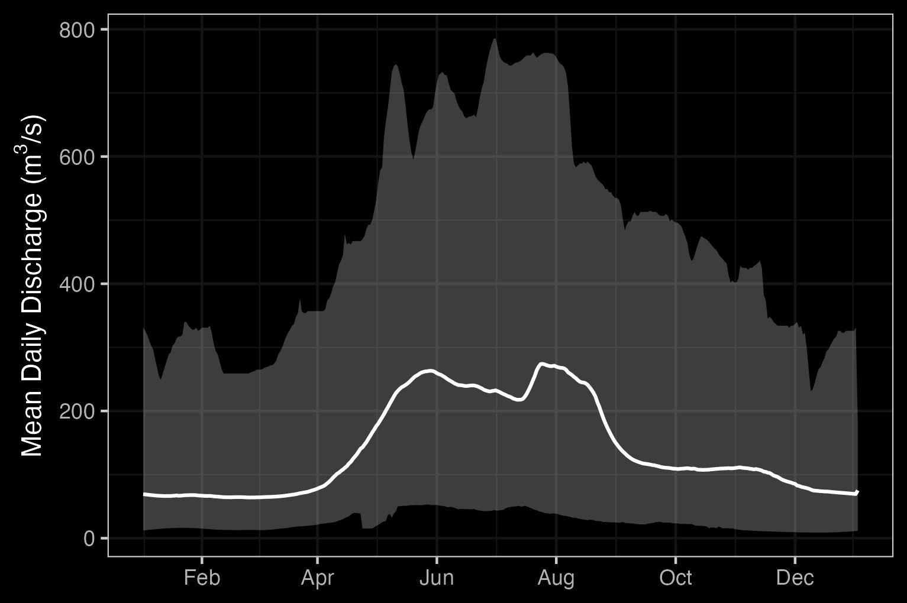
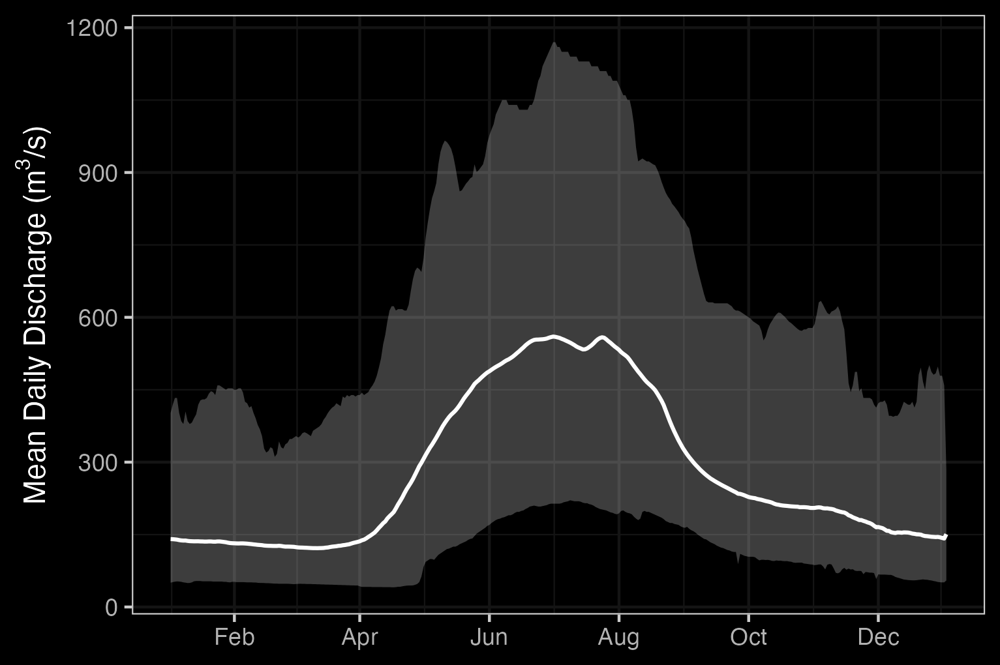
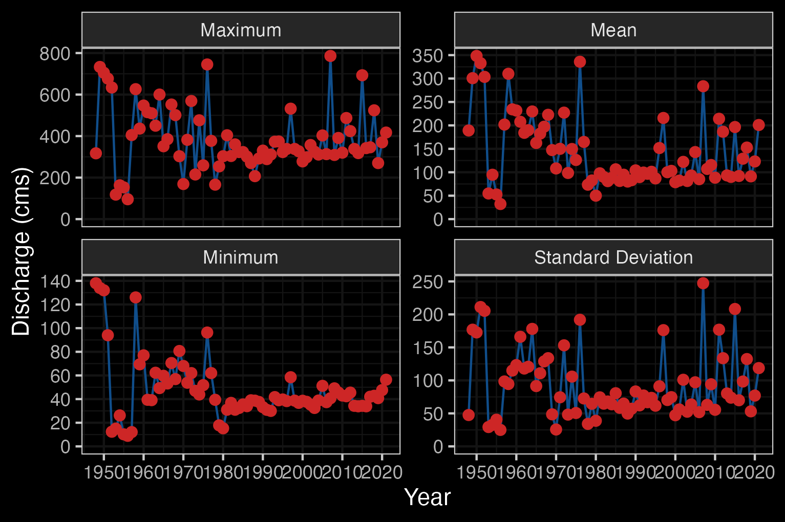
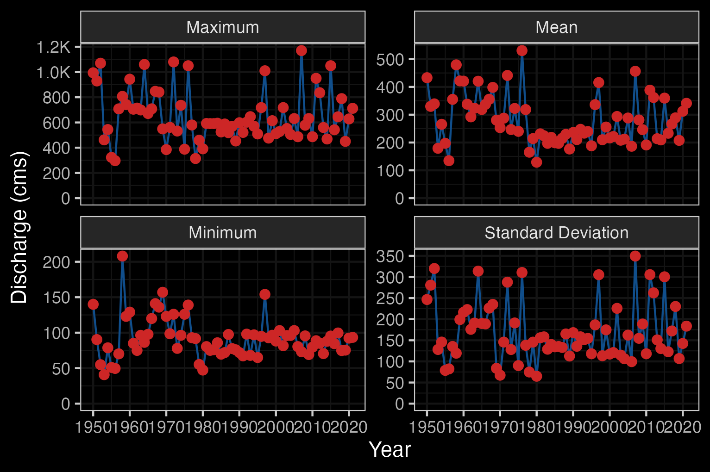
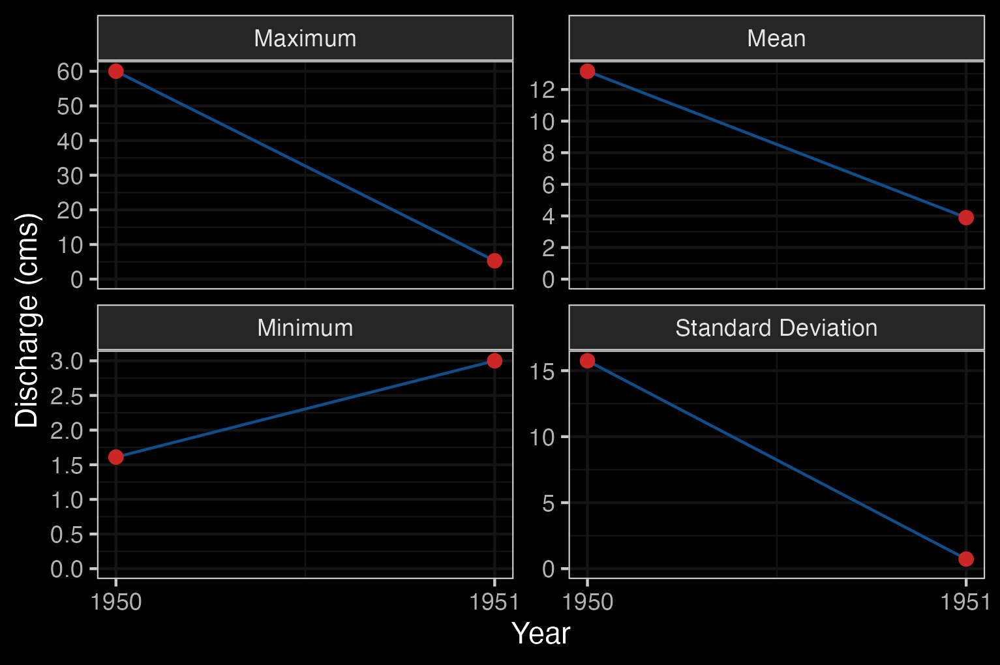
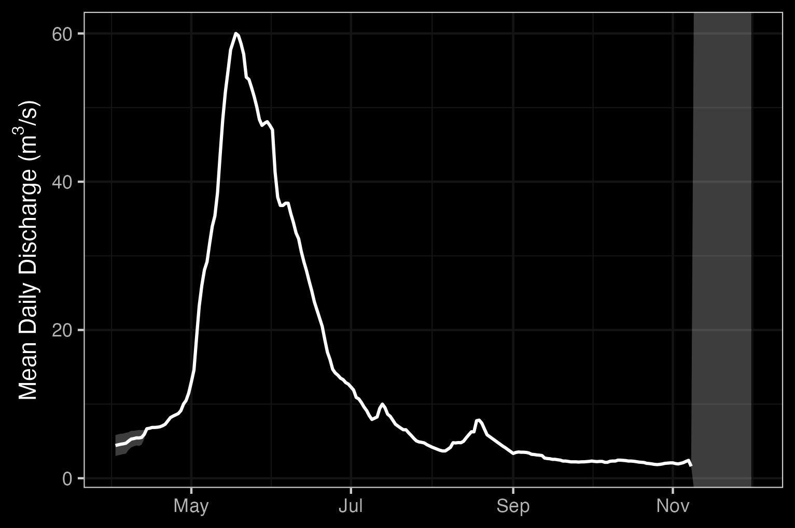
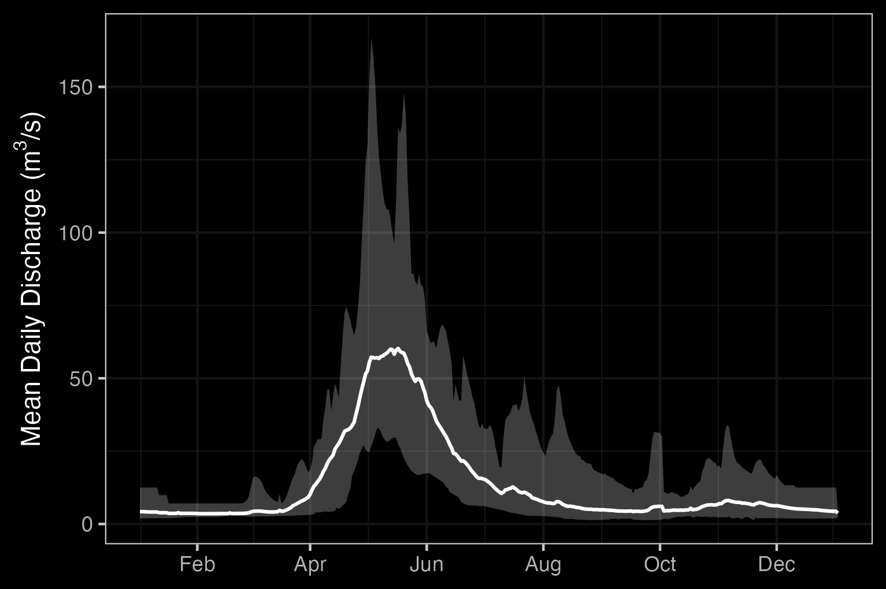
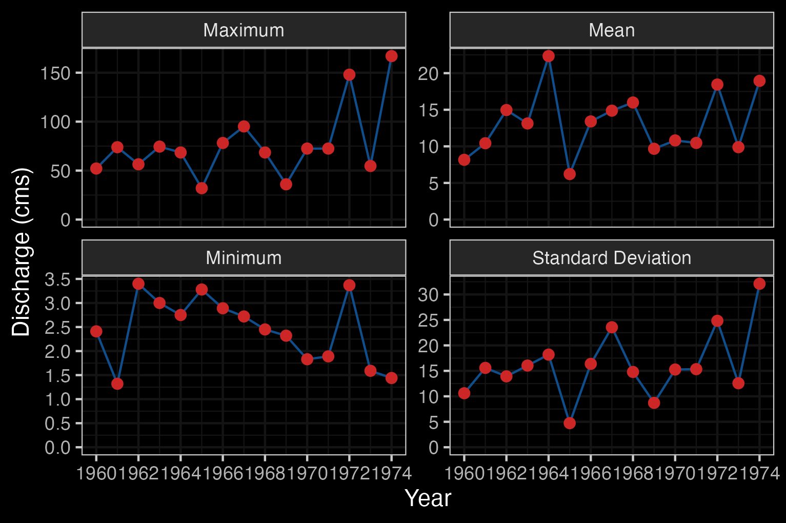

# Background

## Project Location

```{r overview-map, fig.cap = 'Overview map of Study Areas',eval=T}
knitr::include_graphics("fig/nge-icon_name.png")
```


## Nechako River

```{r get-wshd-areas, eval = identical(wshd_area_update, FALSE)}
## Uncomment this code if you want to pull watershed areas for the first time
# wshds <- c("Nechako River", "Endako River", "Chilako River")
# tfpr_get_wshd_area(wshds, update = FALSE)
```

```{r update-wshd-areas, eval = identical(wshd_area_update, TRUE)}
tfpr_get_wshd_area(update = TRUE)
```

```{r load-wshd-areas}
# Pull watershed area data from bcfishpass for background info.
conn <- readwritesqlite::rws_connect("data/bcfishpass.sqlite")
wshd_areas <- readwritesqlite::rws_read_table("stream_info", conn = conn)
DBI::dbDisconnect(conn)
```

The Nechako River is an 8th order stream that drains an area of `r wshd_areas %>% filter(gnis_name == "Nechako River") %>% pull(wshd_area)` km^2^. Beginning at the Nechako Plateau, it flows north towards Fort Fraser then east to its confluence with the Fraser River in Prince George. The Nachako River has three main tributaries: the Stuart River, the Endako River, and the Chilako River. It has a mean annual discharge of `r round(fasstr::calc_longterm_mean(station_number = "08JC001")$LTMAD,1)` m^3^/s at station 08JC001 located in Vanderhoof and `r round(fasstr::calc_longterm_mean(station_number = "08JC002")$LTMAD,1)` m^3^/s at station 08JC002 located in Isle Pierre, \~25km downstream of the Stuart River confluence. Flow patterns at Isle Pierre are heavily influenced by inflows from the Stuart River (enters downstream of Vanderhoof) resulting in higher peak levels and average discharge (Figures \@ref(fig:hydrology-plots) - \@ref(fig:hydrology-stats2)). The hygrograph at station 08JC001 in Vanderhoof peaks in June and August, with lower peak levels and average discharge (Figures \@ref(fig:hydrology-plots) - \@ref(fig:hydrology-stats1)).


```{r, eval=FALSE}
hydat_stations <- fpr::fpr_db_query(query = lfpr_dbq_clip('whse_environmental_monitoring.envcan_hydrometric_stn_sp',
'whse_basemapping.fwa_watershed_groups_poly', 'watershed_group_code', c("FRAN", "LCHL","NECR")))
```

```{r, eval= FALSE}
# Use if you want to create a hydrograph for a each station, won't print captions though
hydat_stations %>% 
  dplyr::filter(station_operating_status == "ACTIVE-REALTIME") %>% 
  dplyr::filter(!(station_number == '08JB007')) %>% 
  pull(station_number) %>%
  lapply(fpr_create_hydrograph_local)

```


```{r, eval=F}
# starting at 1948 because that's where consistent data starts
lfpr_create_hydrograph("08JC001", start_year = 1948)
```

```{r, eval=F}
lfpr_create_hydrograph("08JC002")
```

```{r hydrology-plots, fig.cap = 'Hydrograph for Nechako River at Vanderhoof (Station #08JC001) and at Isle Pierre (Station #08JC002).', fig.show="hold", out.width= c("49.5%","1%","49.5%"), eval=T}



```

```{r hydrology-stats1, fig.cap = "Nechako River At Vanderhoof (Station #08JC001 - Lat 54.02673 Lon -124.00865). Available daily discharge data from 1948 to 2021."}

```

```{r hydrology-stats2, fig.cap = "Nechako River At Isle Pierre (Station #08JC002 - Lat 53.96044 Lon -123.23486). Available daily discharge data from 1950 to 2022."}

```


## Endako River

The Endako River is a 6th order stream that flows south east from Burns Lake to Fraser Lake. It drains an area of `r wshd_areas %>% filter(gnis_name == "Endako River") %>% pull(wshd_area)` km^2^. There is one hydrometric station on the Endako River located in Endako, but it was only active for one year during 1951. Given the one year of data, the mean annual discharge is `r round(fasstr::calc_longterm_mean(station_number = "08JB004")$LTMAD,1)` m^3^/s at station 08JB004. The hydrograph peaks in May-June (Figure \@ref(fig:hydrograph1)).

```{r, eval=FALSE}
lfpr_create_hydrograph("08JB004")
```


```{r hydrology-stats3, fig.cap = "Endako River At Endako (Station #08JB004 - Lat 54.08194 Lon -125.021111). Available daily discharge data from 1950 to 1951.", eval=FALSE}

```


```{r hydrograph1, fig.cap = "Endako River At Endako (Station #08JB004 - Lat 54.08194 Lon -125.021111). Available mean daily discharge data from 1950 to 1951."}

```


## Chilako River

The Chilako River is a 6th order stream that flows north from the Nechako Plateau to the Nechako River. It drains an area of `r wshd_areas %>% filter(gnis_name == "Chilako River") %>% pull(wshd_area)` km^2^. There is one hydrometric station on the Chilako River located ~10km upstream of the mouth, but it was only active from 1960-1974. Given this data, the hydrograph peaks in May-June (Figures \@ref(fig:hydrograph2) - \@ref(fig:hydrology-stats4)).

```{r, eval=FALSE}
lfpr_create_hydrograph("08JC005")
```

```{r hydrograph2, fig.cap = "Chilako River Near Prince George (Station #08JC005 - Lat 53.808891 Lon -122.988892). Available mean daily discharge data from 1960 to 1974."}

```

```{r hydrology-stats4, fig.cap = "Chilako River Near Prince George (Station #08JC005 - Lat 53.808891 Lon -122.988892). Available daily discharge data from 1960 to 1974."}

```


