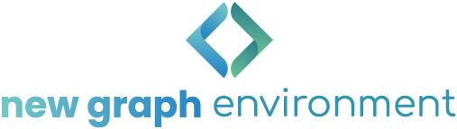

# Background

## Project Location

The name of the Nechako River originated from the Cheslatta Carrier First Nation name Netʃa Koh which means “Big River" [@nfcptechnicalcommittee2023NechakoFisheries]. The Nechako River is an important water body for the First Nation communities living within the watershed, with Nechako salmon being an integral food source as well as an important part of First Nations culture [@nfcptechnicalcommittee2023NechakoFisheries]. The Nechako watershed overlaps with 15 different First Nation territories, including Binche First Nation, Cheslatta Carrier Nation, Lake Babine First Nation, Lheidli T’enneh First Nation, Nadleh Whut’en First Nation, Nak'azdli First Nation, Nee Tahi Buhn First Nation, Saik’uz First Nation, Skin Tyee Nation First Nation, Stellat’en First Nation, Takla First Nation, Tl’azt’en Nation, Ts’il Kaz Koh First Nation, Wet’suwet’en First Nation, and Yekooche First Nation [@nechakowatershedroundtable2021StrategicPlan]. In addition to these First Nation communities, the Nechako watershed encompasses the Regional District of Bulkley-Nechako and part of the Regional District of Fraser-Fort George, as well as five municipalities: Prince George, Vanderhoof, Fraser Lake, Fort St. James, and Burns Lake [@nechakowatershedroundtable2021StrategicPlan].


The Nechako River is the second largest tributary to the Fraser River and provides important habitat for salmon, white sturgeon, and trout species [@nechakowatershedroundtableWatershed]. Due to natural resource extraction being the primary economic driver in the region, the Nechako watershed has been heavily impacted by hydroelectric, forestry and mining activities over the last 100 years [@nechakowatershedroundtable2021StrategicPlan]. Most notably, the construction of the Kenney Dam on the Nechako River in 1954 by the Aluminum Company of Canada (later Alcan Inc. and now Rio Tinto) [@macdonald_etal2007ExaminationFactors]. The dam, built in the Nechako River Grand Canyon, flooded close to 30% of the Nechako River watershed which is now the Nechako Reservoir [@macdonald_etal2007ExaminationFactors]. Roughly 65% of the water was then diverted to a powerhouse at Kemano on the other side of the Coast Mountains to support hydroelectricity generation and aluminum production on BC’s northwest coast [@nfcptechnicalcommittee2023NechakoFisheries]. This resulted in a significant reduction of flows (only 35%) to the Nechako River, with flows entering the Nechako River via the Skins Lake Spillway in the Cheslatta watershed, and only natural inflows to the Nechako canyon below the Kenney Dam [@nfcptechnicalcommittee2023NechakoFisheries]. 

Due to Alcan's decision to release water into the Cheslatta river via the Skins Lake Spillway instead of building a release facility at the Kenney Dam, there has been a significant impact on the Nechako River and its tributaries [@cheslattacarriernationEnvironmentalStewardship]. A portion of the upper Nechako River has dried up because it only receives natural flows. Additionally, releases from the Skins Lake Spillway have caused the Cheslatta people to be forcibly evicted from their homelands and the Cheslatta River and Lake undergo annual flooding events due to the increased flows [@cheslattacarriernationEnvironmentalStewardship].


There has been a significant amount of research done regarding the Kenney Dam and it's effects on fish populations residing in within the watershed. Currently, there is a Summer Temperature Management Program (STMP) in place which aims to minimize occurrences of water temperatures above 20 °C in the Nechako River during sockeye migrations, through gate changes at the Skins Lake Spillway [@nfcptechnicalcommittee2023NechakoFisheries]. There is also a Annual Water Allocation (AWA) program in place to allocate water flows to provide the greatest benefit for Nechako River Chinook [@nfcptechnicalcommittee2023NechakoFisheries]. The construction of the dam has been associated with a significant decline in white sturgeon populations [@antill_etal2013RecruitmentBiochronology].


Due to the altered flow regime, the Kenney Dam Surface Water Release Facility (KDRF) was proposed but has yet to be implemented. The facility would allows for more efficient use of the water budget, re-watering of the Nechako Canyon, and would freed up flows due to the STMP longer being needed [@nfcptechnicalcommittee2023NechakoFisheries]. From an ecological standpoint, the KDRF is important for re-watering the Nechako Canyon below the Kenney Dam which contain valuable fish habitat, re-shaping of the Nechako River hydrograph which has been greatly altered due to the dam, restoring the Cheslatta watershed which currently experiences higher flows due to water being released solely from the Skins Lake Spillway, and providing beneficial habitat for sturgeon [@nfcptechnicalcommittee2023NechakoFisheries]. The Cheslatta Carrier Nation have been advocating for a release facility at the Kenney Dam for decades and are actively working with Rio Tinto to make the facility a reality [@cheslattacarriernationEnvironmentalStewardship]. As of reporting, the KDRF has not been implemented due to the high cost of the project and the benefits still remaining uncertain [@nfcptechnicalcommittee2023NechakoFisheries].   


Most recently, fish population in the Nechako watershed were impacted in June 2019 by the Big Bar landslide when a large slab of rock sheared off into a narrow section of the Fraser River north of Lilloet, creating a 5 meter tall waterfall which presented as a barrier to salmon migration [@dfo2019BigBar]. In the following months, fish were transported above the slide by helicopter, until September 2019 when natural fish migration was regained [@governmentofcanada2019BigBar]. Currently, there is a "nature-like" fishway in place which allows for fish migration at different flow levels, and the Department of Fisheries and Oceans (DFO) is undertaking an analysis to explore options and develop a long‑term solution to address safely restoring fish passage at Big Bar [@governmentofcanada2019BigBar]. The Nechako Fisheries Conservation Program (NFCP) was concerned about the impact of the slide on  Nechako Chinook spawner survival in 2019, and while the escapement numbers for 2019 were low, the NFCP does not expect any residual impacts from the slide on the Nechako Chinook population [@nfcpNechakoRiver].


The scope of this project includes the Nechako River and its tributaries, the Endako River and the Chilako River.


```{r overview-map, fig.cap = 'Overview map of Study Areas',eval=F}

```


## Nechako River

```{r get-wshd-areas, eval = identical(wshd_area_update, FALSE)}
## Uncomment this code if you want to pull watershed areas for the first time
# wshds <- c("Nechako River", "Endako River", "Chilako River")
# tfpr_get_wshd_area(wshds, update = FALSE)
```

```{r update-wshd-areas, eval = identical(wshd_area_update, TRUE)}
tfpr_get_wshd_area(update = TRUE)
```

```{r load-wshd-areas}
# Pull watershed area data from bcfishpass for background info.
conn <- readwritesqlite::rws_connect("data/bcfishpass.sqlite")
wshd_areas <- readwritesqlite::rws_read_table("stream_info", conn = conn)
DBI::dbDisconnect(conn)
```


The Nechako River is an 8th order stream that drains an area of `r wshd_areas %>% filter(gnis_name == "Nechako River") %>% pull(wshd_area)` km^2^. Beginning at the Nechako Plateau, it flows north towards Fort Fraser then east to its confluence with the Fraser River in Prince George. The Nachako River has three main tributaries: the Stuart River, the Endako River, and the Chilako River. It has a mean annual discharge of `r round(fasstr::calc_longterm_mean(station_number = "08JC001")$LTMAD,1)` m^3^/s at station 08JC001 located in Vanderhoof and `r round(fasstr::calc_longterm_mean(station_number = "08JC002")$LTMAD,1)` m^3^/s at station 08JC002 located in Isle Pierre, \~25km downstream of the Stuart River confluence. Flow patterns at Isle Pierre are heavily influenced by inflows from the Stuart River (enters downstream of Vanderhoof) resulting in higher peak levels and average discharge (Figures \@ref(fig:hydrology-plots) - \@ref(fig:hydrology-stats2)). The hygrograph at station 08JC001 in Vanderhoof peaks in June and August, with lower peak levels and average discharge (Figures \@ref(fig:hydrology-plots) - \@ref(fig:hydrology-stats1)).


```{r, eval=FALSE}
hydat_stations <- fpr::fpr_db_query(query = lfpr_dbq_clip('whse_environmental_monitoring.envcan_hydrometric_stn_sp',
'whse_basemapping.fwa_watershed_groups_poly', 'watershed_group_code', c("FRAN", "LCHL","NECR")))
```

```{r, eval= FALSE}
# Use if you want to create a hydrograph for a each station, won't print captions though
hydat_stations %>% 
  dplyr::filter(station_operating_status == "ACTIVE-REALTIME") %>% 
  dplyr::filter(!(station_number == '08JB007')) %>% 
  pull(station_number) %>%
  lapply(fpr_create_hydrograph_local)

```


```{r, eval=F}
# starting at 1948 because that's where consistent data starts
lfpr_create_hydrograph("08JC001", start_year = 1948)
```

```{r, eval=F}
lfpr_create_hydrograph("08JC002")
```

```{r hydrology-plots, fig.cap = 'Hydrograph for Nechako River at Vanderhoof (Station #08JC001) and at Isle Pierre (Station #08JC002).', fig.show="hold", out.width= c("49.5%","1%","49.5%"), eval=T}
knitr::include_graphics("fig/hydrograph_08JC001.png")
knitr::include_graphics("fig/pixel.png")
knitr::include_graphics("fig/hydrograph_08JC002.png")
```

```{r hydrology-stats1, fig.cap = "Nechako River At Vanderhoof (Station #08JC001 - Lat 54.02673 Lon -124.00865). Available daily discharge data from 1948 to 2021."}
knitr::include_graphics("fig/hydrology_stats_08JC001.png")
```

```{r hydrology-stats2, fig.cap = "Nechako River At Isle Pierre (Station #08JC002 - Lat 53.96044 Lon -123.23486). Available daily discharge data from 1950 to 2022."}
knitr::include_graphics("fig/hydrology_stats_08JC002.png")
```


## Endako River

The Endako River is a 6th order stream that flows south east from Burns Lake to Fraser Lake. It drains an area of `r wshd_areas %>% filter(gnis_name == "Endako River") %>% pull(wshd_area)` km^2^. There is one hydrometric station on the Endako River located in Endako, but it was only active for one year during 1951. Given the one year of data, the mean annual discharge is `r round(fasstr::calc_longterm_mean(station_number = "08JB004")$LTMAD,1)` m^3^/s at station 08JB004. The hydrograph peaks in May-June (Figure \@ref(fig:hydrograph1)).

```{r, eval=FALSE}
lfpr_create_hydrograph("08JB004")
```


```{r hydrology-stats3, fig.cap = "Endako River At Endako (Station #08JB004 - Lat 54.08194 Lon -125.021111). Available daily discharge data from 1950 to 1951.", eval=FALSE}
knitr::include_graphics("fig/hydrology_stats_08JB004.png")
```


```{r hydrograph1, fig.cap = "Endako River At Endako (Station #08JB004 - Lat 54.08194 Lon -125.021111). Available mean daily discharge data from 1950 to 1951."}
knitr::include_graphics("fig/hydrograph_08JB004.png")
```


## Chilako River

The Chilako River is a 6th order stream that flows north from the Nechako Plateau to the Nechako River. It drains an area of `r wshd_areas %>% filter(gnis_name == "Chilako River") %>% pull(wshd_area)` km^2^. There is one hydrometric station on the Chilako River located ~10km upstream of the mouth, but it was only active from 1960-1974. Given this data, the hydrograph peaks in May-June (Figures \@ref(fig:hydrograph2) - \@ref(fig:hydrology-stats4)).

```{r, eval=FALSE}
lfpr_create_hydrograph("08JC005")
```

```{r hydrograph2, fig.cap = "Chilako River Near Prince George (Station #08JC005 - Lat 53.808891 Lon -122.988892). Available mean daily discharge data from 1960 to 1974."}
knitr::include_graphics("fig/hydrograph_08JC005.png")
```

```{r hydrology-stats4, fig.cap = "Chilako River Near Prince George (Station #08JC005 - Lat 53.808891 Lon -122.988892). Available daily discharge data from 1960 to 1974."}
knitr::include_graphics("fig/hydrology_stats_08JC005.png")
```

## Fisheries

After the construction of the Kenney Dam in 1952, Chinook escapement fell roughly 10-fold [@nfcpNechakoRiver]. Since then, escapement numbers have gradually increased and have generally met the conservation goals, with the highest escapement recorded durating of NFCP monitoring (1988 - 2018) occurring in 2015 [@nfcpNechakoRiver]. Nevertheless, Nechako Chinook are part of the Mid-Fraser Summer Chinook Conservation Unit that was designated by the Committee on the Status of Endangered Wildlife in Canada (COSEWIC) as Threatened in 2018 [@cosewic2018COSEWICAssessment].

Nechako Salmon are also a vulnerable species within the watershed. In 2017, COSEWIC listed eight Fraser sockeye populations as Endangered, two as Threatened and five as Special Concern [@cosewic2017COSEWICassessment].

```{r fiss-species-table}

fiss_species_table <- readr::read_csv('data/inputs_extracted/fiss_species_table.csv')

fiss_species_table %>% 
  fpr::fpr_kable(caption_text = 'Fish species recorded in the Lower Chilako River, Nechako River, and Francois Lake watershed groups.', 
                 footnote_text = 'COSEWIC abbreviations : 
                 SC - Special concern 
                 DD - Data deficient
                 NAR - Not at risk
                 E - Endangered
                 T - Threatened
                 
                 BC List definitions : 
                 Yellow - Species that is apparently secure 
                 Blue - Species that is of special concern
                 Exotic - Species that have been moved beyond their natural range as a result of human activity
                 ',
                 scroll = gitbook_on)


```
